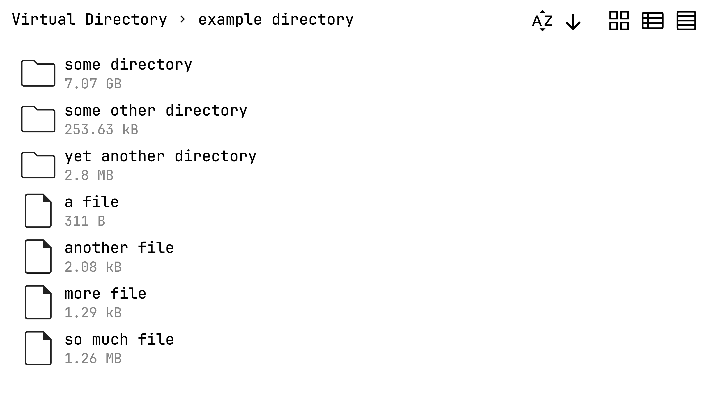

# gshare3

A web-based file sharing program

### Examples
`gshare` Serves current directory 
`gshare 192.168.1.184` Only allows that IP to connect 
`gshare some_directory a_file_somewhere` Serves these two paths instead 
`gshare some_directory a_file_somewhere 192.168.1.184` Combination of the previous two, paths and IP address go into the same list, the order doesn't matter

`gshare --upload` Clients can now upload files by dragging and dropping or double-clicking. A unique filename will be generated, files will never be overwritten 
`gshare --upload-overwrite` Files will be overwritten 
`gshare --help` See all options

> [!TIP]
> Remember to allow the port (default 8000) through your firewall!

gshare3 is like `python -m http.server` but with
- Whitelisting
- "Virtual directories" that allow you to serve files and multiple paths
- Uploading
- File *and* directory sizes (directory sizes are calculated recursively on a separate thread)
- Sorting options
- Grid and comfy list views
- CSS
